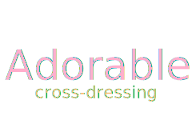

	 
    

---

## :cupid: 可爱的 Adorable

:fire::fire::fire::fire::fire::fire::fire::fire::fire::fire::fire::fire::fire::fire::fire::fire::fire::fire::fire::fire:
:fire::fire::fire::fire::fire::fire::fire::fire::fire::fire::fire::fire::fire::fire::fire::fire::fire::fire::fire::fire:
:fire::fire::fire::fire::fire::fire::rocket:

___面向可爱的男孩子们:heart_eyes:的公开仓库，一起来女装吧~ :two_hearts::two_hearts::two_hearts:___

___A public repository for adorable boys :heart_eyes:, let's come to the cross-dressing together~ :two_hearts::
two_hearts:
:two_hearts:___

## :loudspeaker: 须知 Instruction

> 本仓库并不要求你贡献任何代码，没有任何编程技能都可以参加，唯一要求是准备好至少一张女装照片~ :yum::yum::yum:
> This repository does not require you to contribute any code. You can participate without any programming skills.
> The only requirement is to prepare at least one photo of cross-dressing ~ :yum::yum::yum:

- 关于图片上传规则 About image upload rules
  > - 禁止盗图和未经授权转载他人图片！！！
  > - 请务必在仓库的`boys`目录下创建和你`github用户名`***相同***的文件夹，所有的图片和描述文件都放在你自己创建的文件夹中，如果搜索不到你的`github用户名`，会被`关闭拉取请求`（Close Pull Request）。
  > - 文件夹名字中不允许出现任何非`字母、数字`的其他任何字符，长度不能超过`39位`，大小写不限（没错，这就是github的用户名规范:ghost:）。
  > - 如果需要在你的文件夹内创建描述文件，请务必使用 [Markdown](https://zh.wikipedia.org/zh-hans/Markdown) 语法来编写。
  > - 图片请尽量压缩大小，并删除 [Exif](https://zh.wikipedia.org/zh-hans/Exif) 信息，图片质量过低的`Pull Request`会被`Close`！
  > - The theft of pictures and unauthorized reprinting of other people’s pictures are prohibited! ! !
  > - Be sure to create a folder with the ***same*** name as your `github username` in the `boys` directory of the warehouse. All pictures and description files are placed in the folder you created. If your github user name cannot be searched, it will be `Close Pull Request`.
  > - Any characters other than `letters or numbers` are not allowed in the folder name, the length cannot exceed `39 characters`, and the case is not limited (yes, this is the user name specification of github:ghost:).
  > - If you need to create a description file in your folder, be sure to use the [Markdown](https://en.wikipedia.org/wiki/Markdown) syntax to write it.
  > - Please compress the size of the picture as much as possible and delete the [Exif](https://en.wikipedia.org/wiki/Exif) information. `Pull Request` with low picture quality will be `Close`!

- 关于如何删除`Exif`
  > - 请点击右边按钮查看如何删除~:stuck_out_tongue_winking_eye::stuck_out_tongue_winking_eye::stuck_out_tongue_winking_eye:
  > 
  > - Please click the button on the right to see how to delete~ :stuck_out_tongue_winking_eye::stuck_out_tongue_winking_eye::stuck_out_tongue_winking_eye:

## :lock: 许可声明 License

    

        
    

    

         本仓库默认采用<a rel="license" href="https://creativecommons.org/licenses/by-nc-nd/4.0/">知识共享署名-非商业性使用-禁止演绎 4.0 国际许可协议</a>进行许可。 
        This repository is licensed under a <a rel="license" href="https://creativecommons.org/licenses/by-nc-nd/4.0/">
        Creative Commons Attribution-NonCommercial-NoDerivatives 4.0 International License</a> by default.
    

