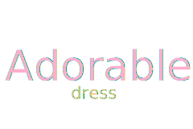

	 
    

---

# :cupid: 可爱的 Adorable
:fire::fire::fire::fire::fire::fire::fire::fire::fire::fire::fire::fire::fire::fire::fire::fire::fire::fire::fire::fire:
:fire::fire::fire::fire::fire::fire::fire::fire::fire::fire::fire::fire::fire::fire::fire::fire::fire::fire::fire: :rocket:

___面向可爱的男孩子们:heart_eyes:的公开仓库，一起来女装吧~:two_hearts::two_hearts::two_hearts:___

___A public repository for adorable boys :heart_eyes:, let's come to the dress together~:two_hearts::two_hearts::
two_hearts:___

# :loudspeaker: 须知 Instruction

> 本仓库并不要求你贡献任何代码，没有任何编程技能都可以参加，唯一要求是准备好至少一张女装照片~ :yum::yum::yum:
> This repository does not require you to contribute any code. You can participate without any programming skills.
> The only requirement is to prepare at least one photo of dress ~ :yum::yum::yum:

# :lock: 许可声明 License

    

        
    

    

         本仓库默认采用<a rel="license" href="https://creativecommons.org/licenses/by-nc-nd/4.0/">知识共享署名-非商业性使用-禁止演绎 4.0 国际许可协议</a>进行许可。 
        This repository is licensed under a <a rel="license" href="https://creativecommons.org/licenses/by-nc-nd/4.0/">Creative Commons Attribution-NonCommercial-NoDerivatives 4.0 International License</a> by default.
    

